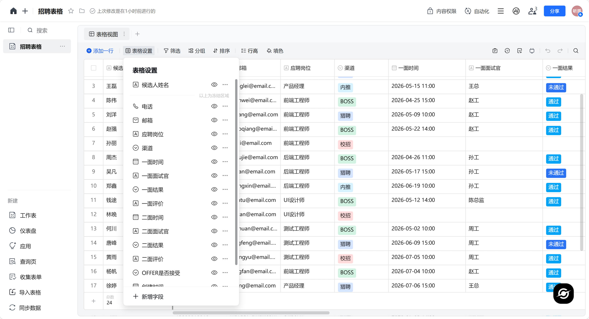
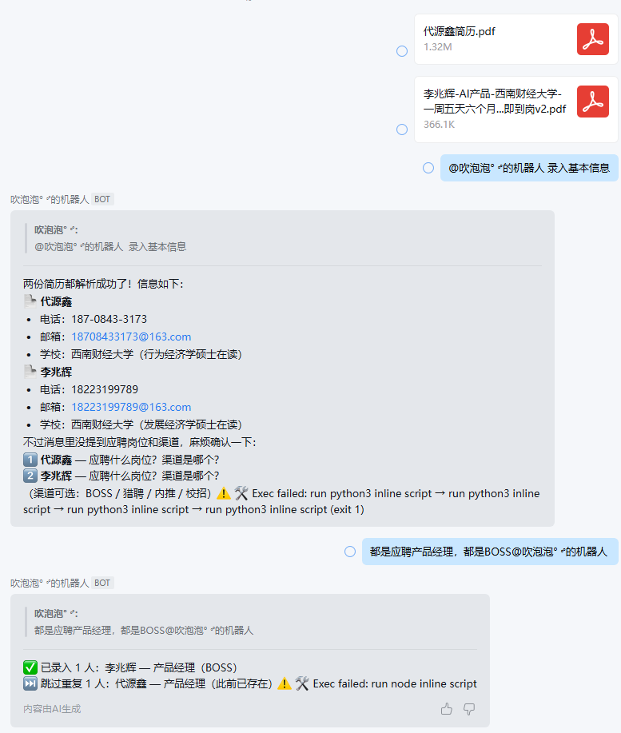
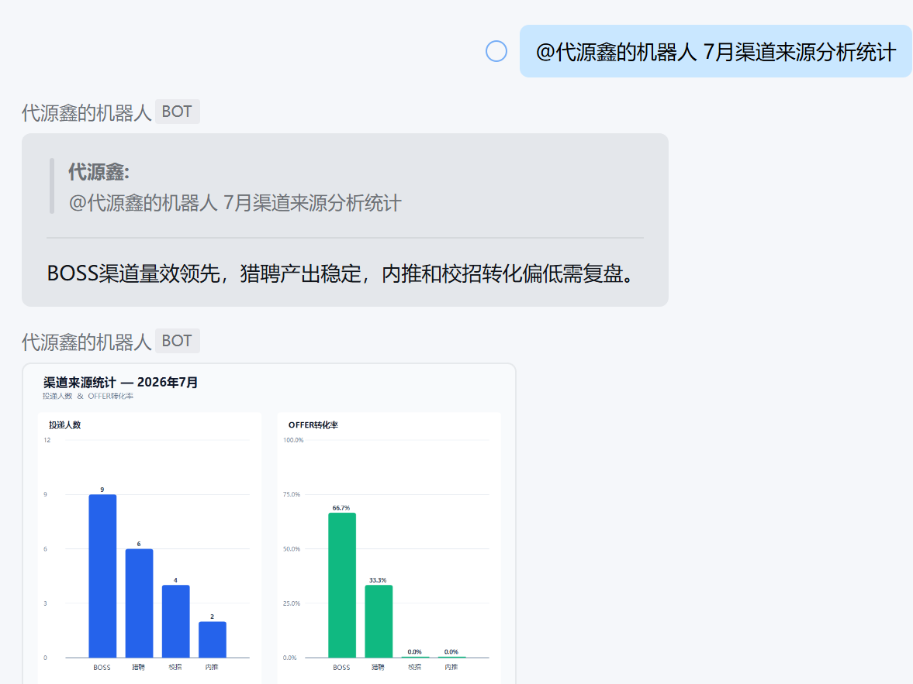
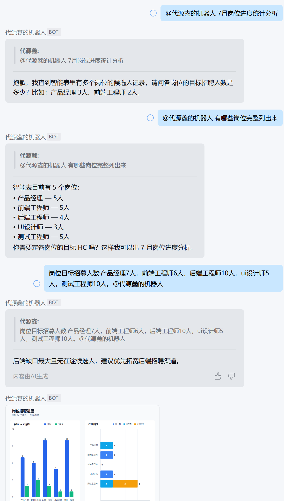

# 招聘提效场景 AI 应用方案


基于 [OpenClaw](https://docs.openclaw.ai) 的 AI 招聘助手，接入企业微信智能机器人，通过腾讯文档 MCP 操作智能表完成候选人信息录入、面试流程跟进和招聘数据复盘。

---

## 方案概述

核心思路：**不改变 HR 现有的工作习惯**，在企业微信 + 腾讯文档这套工具链上叠加 AI 能力，让机器人替代手工操作，而非替换整个系统。

### 设计原则

| 原则 | 说明 |
|------|------|
| **零切换成本** | HR 无需学习新系统。在企业微信群里 @机器人 即可完成所有操作——录入、查询、复盘都在聊天窗口内完成 |
| **最小化改造** | 不替换腾讯文档，不引入新数据库或后端服务。数据仍存储在腾讯文档智能表中，AI 通过 MCP 协议直接操作现有表格 |
| **自然语言驱动** | HR 不需要记住命令格式。说"录入基本信息"+"发PDF"就能录入，说"月度复盘"就能出报表。LLM 理解语义后自动匹配对应 Skill |
| **可审计可纠错** | 候选人有重名风险？查重后追问确认才写入。信息不完整？追问缺失字段。所有操作留痕于智能表 |

### 技术架构

```
企业微信（群聊/私聊）
    │
    ▼
WeChat Work Plugin（消息解密、附件下载、XML解析）
    │
    ▼
OpenClaw Gateway（Agent 运行时 + Skill 文件注入）
    │
    ▼
DeepSeek V4 Flash（理解自然语言 → 匹配Skill → 调用工具）
    │
    ▼
mcporter / MCP 协议
    │
    ▼
腾讯文档智能表（17字段，唯一数据源）
```

### 核心功能

| 功能 | 触发方式 | 说明 |
|------|---------|------|
| **简历录入** | `@机器人 录入基本信息` + PDF | LLM 解析简历 → 查重 → 写入智能表 |
| **流程更新** | `@机器人 面试流程信息` | 更新一面/二面/OFFER 各节点状态 |
| **招聘进度** | `招聘进度 产品经理3人` | 按岗位统计目标 vs 已接受OFFER vs 流程中 |
| **转化漏斗** | `月度复盘` / `季度复盘` | 初筛→一面→二面→OFFER 各阶段通过率 |
| **渠道分析** | `渠道统计 2026年7月` | BOSS/猎聘/内推/校招 转化效果对比 |

### 自创 Skills

通用大模型能够理解自然语言，但招聘业务还涉及固定字段映射、查重规则、统计口径、时间边界和图表输出。将高频流程封装为 Skill，可以把业务规则沉淀为可复用、可审计的标准操作，减少重复提示和模型自由发挥，让同一类请求每次都按一致口径执行。

| Skill | 简介 | 发挥作用的场景 |
|------|------|----------------|
| **`basic-information`** | 解析近时段上传的一份或多份简历 PDF，提取候选人信息，校验必填项并查重后写入招聘智能表 | HR 批量收到简历后，在企微中发出“录入基本信息”指令，减少手工录表 |
| **`channel-stats`** | 按指定周期统计 BOSS、猎聘、内推、校招等渠道的投递量与 OFFER 转化率，输出一句结论和渠道对比图 | 月度渠道复盘、招聘预算分配、识别高效或低效候选人来源 |
| **`funnel-stats`** | 统一计算初筛、一面、二面、OFFER 各阶段人数和通过率，定位流失最明显的环节并生成漏斗图 | 月度、季度招聘复盘，校准筛选标准与面试流程 |
| **`hc-stats`** | 按岗位对比目标 HC、已接受 OFFER、在途候选人与剩余缺口，生成岗位进度图 | HC 盘点、岗位优先级判断、识别候选人储备不足的岗位 |

### Demo 演示

以下为系统在真实企业微信群中的实测截图：










---

## 部署指南

### 环境要求

| 工具 | 最低版本 | 说明 |
|------|---------|------|
| Node.js | ≥ 20 | [下载](https://nodejs.org) |
| npm | ≥ 10 | 随 Node.js 自带 |
| Git | ≥ 2.0 | [下载](https://git-scm.com) |

> **操作系统**：Windows / macOS / Linux 均可。下文路径中 `~` 表示用户目录。

### 1. 安装并初始化 OpenClaw

在 **PowerShell** 中执行：

```powershell
npm install -g openclaw@latest
openclaw onboard --install-daemon
```

第二条命令会进入交互式配置向导，按提示操作：

1. **模型服务商** — 选择你有 API Key 的服务商（推荐 DeepSeek）
2. **输入 API Key** — 粘贴你的 Key（仅保存在本机）
3. **安装后台服务** — 选择**确认**，电脑开机后机器人自动保持在线
4. 其他选项暂时保持默认

配置完成后验证：

```powershell
openclaw gateway status
# 看到 Gateway 正在运行即可
```

> 如果后续想换模型，编辑 `~/.openclaw/openclaw.json` 中的 `agents.defaults.model.primary` 字段。
> 记得在配置channel的时候选择skip，后续按照企业微信官方文档流程接入企业微信更方便。

### 2. 接入企业微信

参考企业微信官方文档 **2.2.2 章节**：[在本地终端部署 OpenClaw 并关联机器人](https://open.work.weixin.qq.com/help2/pc/cat?doc_id=21657)

### 3. 配置腾讯文档

参考 [https://docs.qq.com/scenario/open-claw.html?nlc=1](https://docs.qq.com/scenario/open-claw.html?nlc=1)，按页面引导完成授权。

> 授权后可实现企业微信机器人与腾讯文档的关联，支持创建、修改等操作。

### 4. 部署本工作区

```bash
# 备份原工作区（如果有的话）
mv ~/.openclaw/workspace ~/.openclaw/workspace.bak 2>/dev/null

# 克隆
git clone https://github.com/day18708433173-crypto/openclaw-workspace.git ~/.openclaw/workspace
```

克隆后，自行更改tools.md文件中所关联的腾讯文档。
